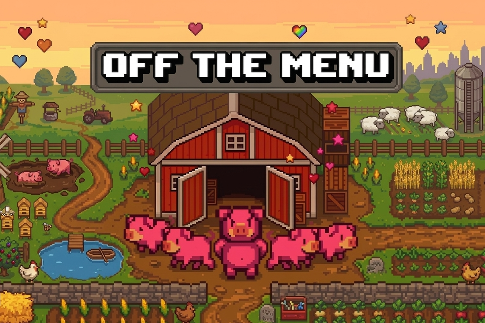

# Off the Menu™
<p align="center">
  
</p>

<p align="center">
  <a href="https://youtu.be/mYbKIifXgP0">▶ Watch the Trailer</a>
</p>

### About

A 2D arcade game built with Java and Swing. Play as a pig escaping a farm, collect your fellow companions (pigs) to open the barn, dodge farmers, and avoid electric fences!

---

## Prerequisites

Make sure the following are installed before you begin:

| Tool | Version | Check with |
|---|---|---|
| Java (JDK) | 21+ | `java -version` |
| Apache Maven | 3.8+ | `mvn -version` |

---

## Getting Started

Clone the repository and navigate into the `game` directory. All commands below should be run from here:

```bash
cd game
```

---
## Decompress resources foulder

```bash
cd /src/main/
tar -xvzf resourcesd.tar.gz
```

---
## Build

```bash
mvn compile
```

---

## Package (JAR)

```bash
mvn package
```

This also runs all tests before packaging. To skip tests:

```bash
mvn package -DskipTests
```

This produces the following files inside `target/`:

| File | Description |
|------|-------------|
| `OffTheMenu.jar` | Executable fat JAR (includes all dependencies and resources) |

### Run the JAR directly

```bash
java -jar target/OffTheMenu.jar
```

### View the Javadocs

```bash
mvn javadoc:javadoc
```

Then open the docs in your browser:

```bash
start target/javadocs/index.html        # Windows
open target/javadocs/index.html         # macOS
xdg-open target/javadocs/index.html    # Linux
```

---

## Run (via Maven)

```bash
mvn exec:java
```

This launches the Off the Menu™ game window.

---

## Run Tests

```bash
mvn test
```

To view the code coverage report (JaCoCo), open this file in your browser after running tests:
target/site/jacoco/index.html


---

## How to Play

### Controls

| Key | Action |
|---|---|
| `W` / `A` / `S` / `D` | Move the pig (up / left / down / right) |
| `↑` / `↓` or `W` / `S` | Navigate menu options |
| `Enter` | Confirm menu selection |
| `P` | Toggle fullscreen |

### Objective

Escape the farm by finding the barn exit!

### Step-by-Step


1. **Collect 3 pigs** — Find and collect 3 pigs hidden across the map. Once you have all 3, the barn exit unlocks. Follow the path to find it!


 


2. **Exit through the barn** — Reach the unlocked barn door to complete the level.

 


3. **Collect wheat** — Pick up wheat along the way to boost your score.


### Watch Out

-  **Farmers** — If a farmer catches you, it's **instant game over**. Evade them at all costs.
-  **Electric Fences** — Each hit counts against you. Hit **3 electric fences** and it's **game over**. Steer clear!

---

## Project Structure

```
Project/
├── game/
│   ├── pom.xml                  # Maven build config
│   └── src/
│       ├── main/java/           # Game source code
│       └── test/java/           # Unit & integration tests
├── Design/                      # Design documents
├── Documents/                   # Project documentation
└── README.md
```

---

## Authors

Spring 2026, Group 4: Nathan Omana, Nima Salehirad, Joshua Tan, Ken Tran - Simon Fraser University
